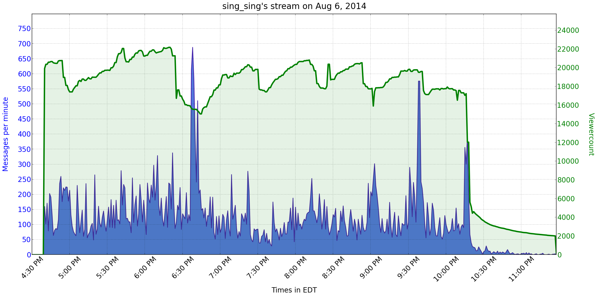
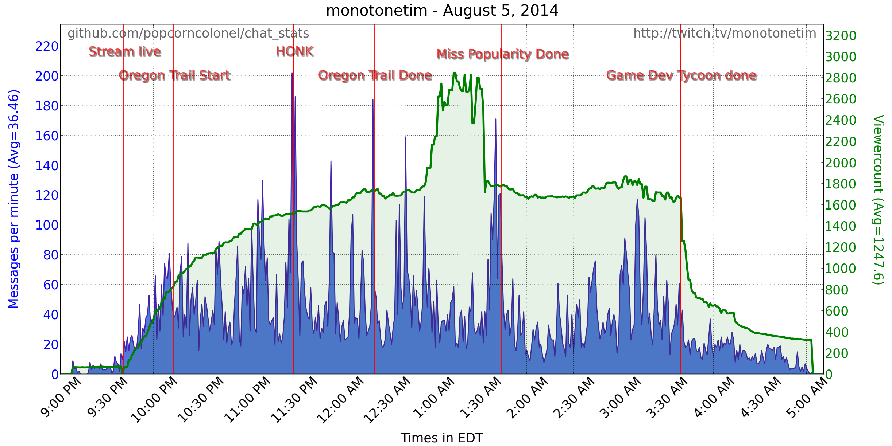
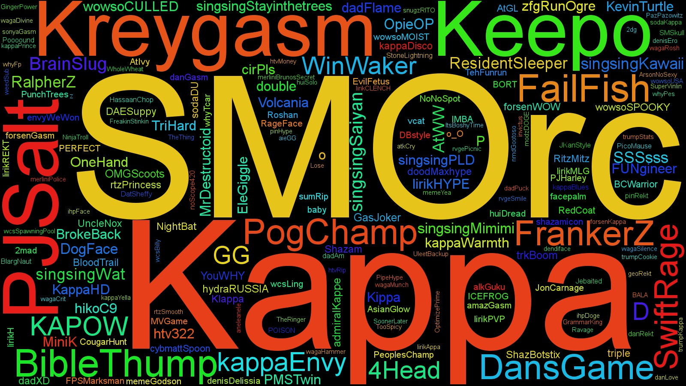

###What is this?###
This is a visualizer for Twitch chat. First, you set it to record the stream. When the stream is over (or you're done recording), the program automatically generates a graph of stream activity (chat rate and viewership) over time, then generates a few word clouds that help to visualize the chat experience. Examples of both can be found in the "examples" directory of this repository.

###USAGE###
####To start recording####
* "**python chat_stats.py [channel]**"

####To analyze data (optional - the images are still generated if you don't run this command):  
* "**python log_reader.py [channel] [date] [type]**" <-- where [type] is an element of {'words', 'emotes', 'authors', 'messages'}

####To manually create images (optional):
* "**python make_plot.py [channel] [time]"** (ex. *python make_plot.py beatsplaypokemon 2014-08-09-11PM*)
* "**python make_cloud.py [channel] [time]**" (ex. *python make_cloud.py beatsplaypokemon 2014-08-09-11PM*)

###GETTING THE DATA###
* Check the logs directory that is created after running chat_stats.py 
* Get the name of the directory you want to read from.  
* Use the command "python log_reader.py [channel] [dir name] [name of log file]"  

###DEPENDENCIES###
* Python 2.7.
* [Matplotlib](http://matplotlib.org/downloads.html) - Graph creation (if you keep create_images as True).  
* [word_cloud](https://github.com/amueller/word_cloud) - Word cloud creation. This can be a pain to install on Windows though. An alternative to this is just to copy+paste the contents of words.log to [http://www.wordle.net](http://www.wordle.net).  
    * [Python Imaging Library](http://www.pythonware.com/products/pil/) - Word cloud creation.  
    * [Cython](http://cython.org/#download) - Word cloud creation.  

###TODO###
* Words per message?  
* Create images (graphs) of the most used emotes

###"I found a bug!"###
[Email me](mailto:eric@ebcmsoftware.com) or [Tweet me](http://twitter.com/popcorncolonel)

###EXAMPLES###
NOTE: These images may be shrunken down, so if they're hard to read, click on them and view the full version.

**Stream activity over time**:

**Stream activity over time**, with optional event labels:

**Emote cloud**:

**Word cloud** (by default, word clouds do not include emotes. To change this, just change "include_emotes" in global_consts.py):

